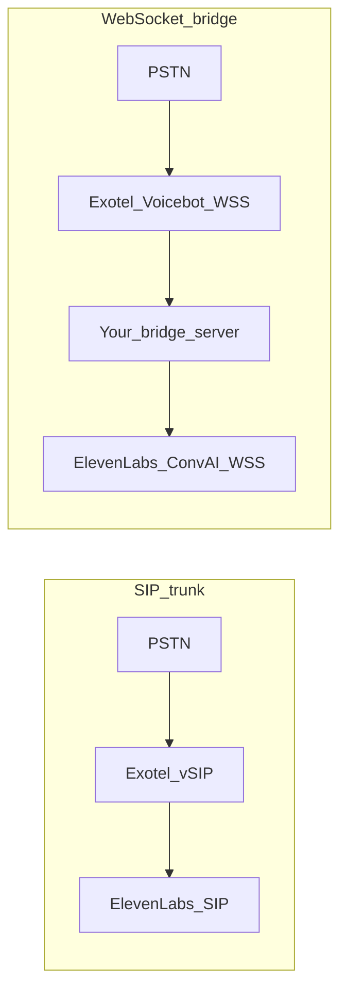

# Integrations: Exotel + ElevenLabs

Two ways to connect **Exotel** telephony to **ElevenLabs Conversational AI** in the Voice AI Ecosystem:

| Approach | Transport | Doc | Best when |
|----------|-----------|-----|-----------|
| **SIP trunk (vSIP)** | SIP (TCP/TLS) to ElevenLabs | [`exotel-vsip/`](./exotel-vsip/) | You want **native** ElevenLabs SIP: PSTN ↔ Exophone with **minimal custom code** (trunk, digest/FQDN, ACL). |
| **WebSocket (Voicebot)** | `wss://` from Exotel Voicebot Applet to **your** server | [`exotel-wss/`](./exotel-wss/) | You already use Exotel **voice streaming** / Voicebot (same pattern as [Agent-Stream](https://github.com/exotel/Agent-Stream)) and need a **bridge** to ElevenLabs ConvAI WebSockets. |

- **SIP:** Audio stays in the telephony/SIP path documented in [exotel-vsip/elevenlabs-voice-ai-connector.md](./exotel-vsip/elevenlabs-voice-ai-connector.md).
- **WSS:** Exotel does **not** connect directly to ElevenLabs’ WebSocket URL—you run middleware that speaks Exotel’s streaming protocol on one side and ElevenLabs [Conversational AI WebSocket](https://elevenlabs.io/docs/agents-platform/api-reference/agents-platform/websocket) on the other. See [exotel-wss/README.md](./exotel-wss/README.md).
